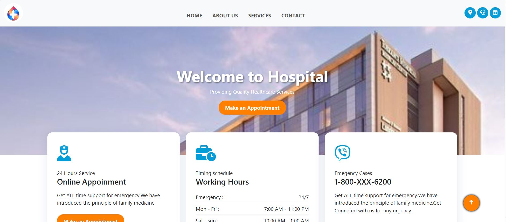
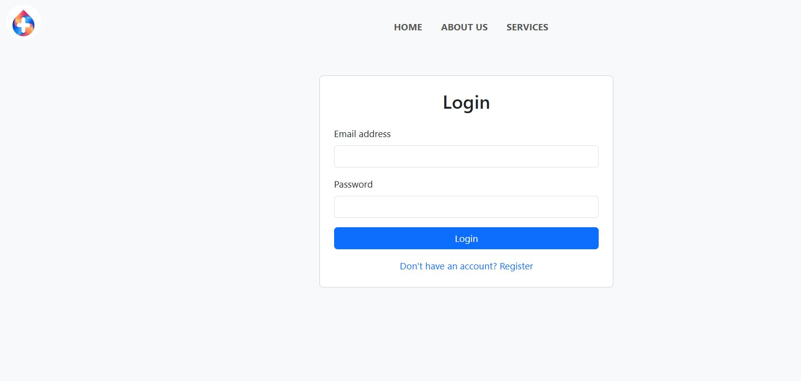
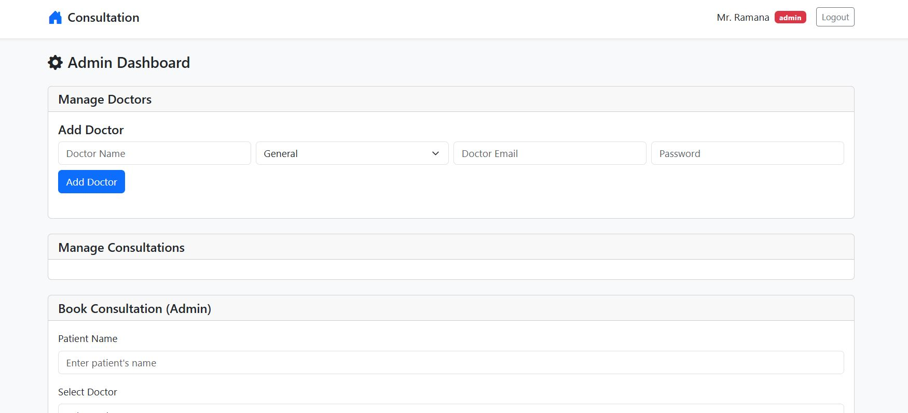
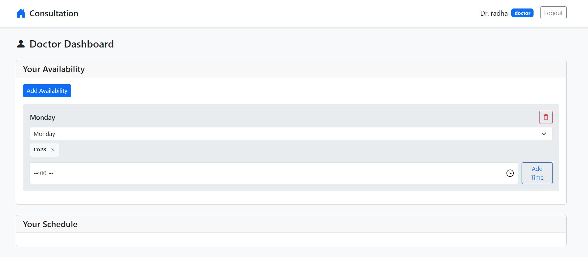
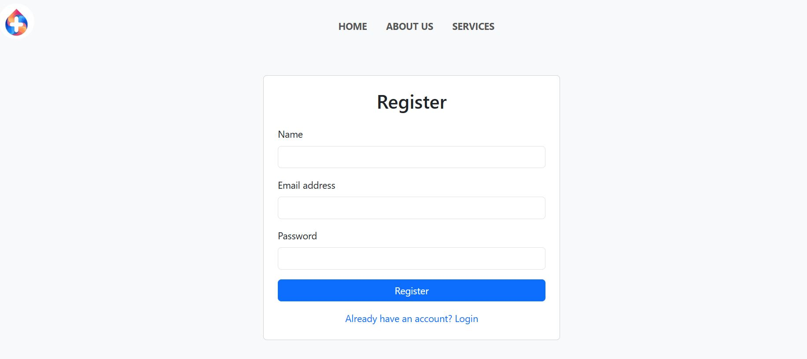
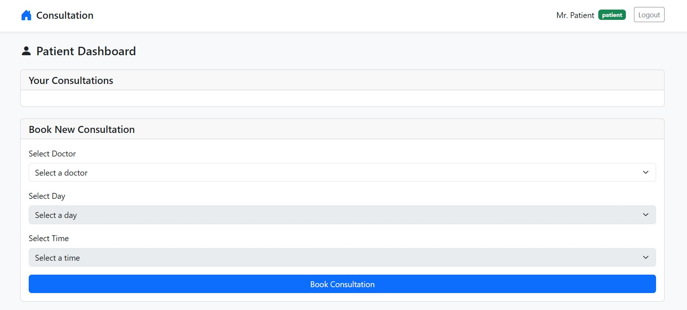

# 🏥 E-MediCare

**E-MediCare** is a web-based medical consultation platform that connects doctors and patients through an intuitive and real-time interface. Built using Firebase and vanilla JavaScript, this application simplifies appointment scheduling, availability management, and real-time updates.

---

## 🔗 Live Demo

👉 [E-MediCare GitHub Pages Deployment]([https://yourusername.github.io/E-MediCare/](https://amruthaakhila0730.github.io/E-MediCare-with-Firbase/))  

---

## 📸 Screenshots
 









---

## 🎯 Features

### 👤 Patient
- Register/Login using email & password
- Book consultations with available doctors
- View and cancel upcoming appointments

### 🩺 Doctor
- Log in to view schedule
- Set availability slots
- Cancel or update availability

### 🛠️ Admin (Optional)
- Register doctors
- Manage in-clinic consultations (queue-based)
- Book appointments for patients (walk-ins)

### ⚙️ System
- Real-time updates using Firebase Firestore
- Firebase Authentication for secure access
- Role-based interface display
- Hosted via GitHub Pages (or Firebase Hosting)

---

## 🛠️ Tech Stack

- **Frontend**: HTML5, CSS3, JavaScript (ES6)
- **Backend / DB**: Firebase (Firestore)
- **Authentication**: Firebase Auth

---

## 📁 Folder Structure

```

E-MediCare/
├── index.html
├── style.css
├── script.js
├── Images/
│   └── All the images
├── README.md
├──BookingConsultations
│   |── index.html
    |── style.css
    └── script.js

````

---

## 🚀 Getting Started

### 1. Clone the Repository

```bash
git clone https://github.com/AmruthaAkhila0730/E-MediCare-with-Firbase.git
cd E-MediCare
````

### 2. Set Up Firebase

1. Go to [Firebase Console](https://console.firebase.google.com/)
2. Create a project and enable:

   * **Authentication** → Email/Password
   * **Firestore Database**
3. Go to Project Settings → General → Your apps → Config
4. Replace the placeholder config in `index.html` with your Firebase credentials:

```js
const firebaseConfig = {
  apiKey: "YOUR_API_KEY",
  authDomain: "YOUR_PROJECT.firebaseapp.com",
  projectId: "YOUR_PROJECT_ID",
  storageBucket: "YOUR_PROJECT.appspot.com",
  messagingSenderId: "YOUR_MSG_ID",
  appId: "YOUR_APP_ID",
};
```


---

## 🔐 Security Guidelines

* Set strict Firebase Firestore rules.


---

## 📃 License

This project is licensed under the **MIT License** — feel free to use and modify it with attribution.

---

## 🙋‍♀️ Author

**Akhila**
🎓 MCA Student | 💻 Aspiring Full Stack Web Developer
| 📬 amruthaakhila0730@gmail.com
| 📍 India

---

## 💡 Future Improvements (TODO)

* Add responsive mobile design
* Integrate SMS or email reminders
* Implement calendar view for doctors
* integrate forgot password
* Improve Firestore rules for role-based access

---

## ❤️ Acknowledgements

* Firebase for free-tier services
* Open-source community inspiration
